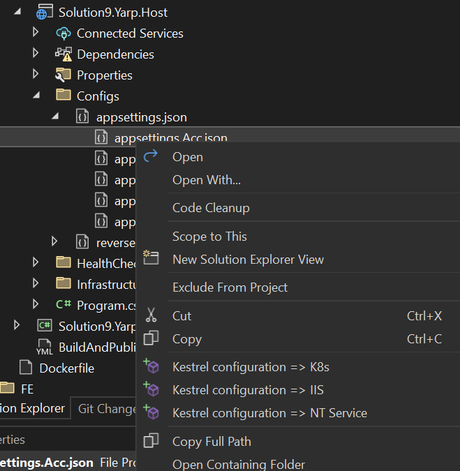

# Release notes for version 2022.2.1.9

- Add .gitignore file
- BuildAndDeploy yaml file.
- Generate default unit test based on xUnit, Moq, Autofixture and FluentAssertion.
- Fix Native application Adfs Json script registration issue.
- Add menu to configure the Kestrel configuration.
- Add NovaDesign for Blazor project (Elia Group only).

## Add .gitignore file.

Add a .gitignore file (can be customized for each customer) during the creation of the solution.

## Generate a BuildAndDeploy.yml file.

Regarding the configuration is defined for a customer as AzureDevOps or Github a specific yaml file (customizable by customer) is generated.<br>
This file is used to Build the service and deploy it.<br>
<br>
A specific file can be defined for:
- Yarp service
- Host service.
- Blazor project.

## Generate default unit test based on xUnit, Moq, Autofixture and FluentAssertion.

When a service is generated, a unit test project is added (below Tests solution folder).<br>
The unit test implemented is unit testing the EnvironmentInfoBL based on Moq, AutoFixture, FluentAssertion and xUnit.

## Fix Native application Adfs Json script registration issue.

When Adfs is selected for the authentication authority, the configuration is based on a json file. This file
is updated when you add a UI (Wpf or Blazor).<br>
Previously, the name of the section was 

For Blazor
```json

      {
        "nativeAppDisplayName": "Solution9 Blazor UI_Application_Name Client",
        "redirectUri": "https://localhost:7247/",
        "identifier": "e8dcb2ae-6d77-4c62-96cf-c8b9715a1d97",
        "settings": "OAuth2.Settings"
      }

```

And now we have 

```json

      {
        "nativeAppDisplayName": "Solution9 Blazor UI_Application_Name Client",
        "redirectUri": "https://localhost:7247/",
        "identifier": "e8dcb2ae-6d77-4c62-96cf-c8b9715a1d97",
        ==> "settings": "Blazor.OAuth2.UI_Application_Name.Settings" <==
      }

```

The OAuth2TokenSettingsReader class is also updated to contain the section given.

```csharp

using Arc4u;
using Arc4u.Configuration;
using Arc4u.Dependency.Attribute;
using Microsoft.Extensions.Configuration;

namespace Elia.Solution9.Blazor.Infrastructure;

[Export("OAuth2", typeof(IKeyValueSettings)), Shared]
public class TokenSettings : KeyValueSettings
{
    public TokenSettings(IConfiguration configuration) : base("Blazor.OAuth2.UI_Application_Name.Settings", configuration)
    {

    }
}

```

For Wpf

```json

      {
        "nativeAppDisplayName": "Wpf Wpf Client",
        "redirectUri": "http://localhost",
        "identifier": "6157fdbc-a6a2-4f40-aa44-25481a5f05cb",
        "settings": "WPF.Settings"
      }

```

and now,

```json

      {
        "nativeAppDisplayName": "Wpf UI_Application_Name Client",
        "redirectUri": "http://localhost",
        "identifier": "6157fdbc-a6a2-4f40-aa44-25481a5f05cb",
        ==> "settings": "WPF.OAuth2.UI_Application_Name.Settings" <==
      }

```

The OAuth2TokenSettingsReader class is also updated to contain the section given.

```csharp

using Arc4u;
using Arc4u.Configuration;
using Arc4u.Dependency.Attribute;
using Microsoft.Extensions.Configuration;

namespace Elia.Solution9.Wpf.Infrastructure;

[Export("OAuth2", typeof(IKeyValueSettings)), Shared]
public class TokenSettings : KeyValueSettings
{
    public TokenSettings(IConfiguration configuration) : base("WPF.OAuth2.UI_Application_Name.Settings", configuration)
    {

    }
}

```

## Add menu to configure the Kestrel configuration

On each service you can select an appsettings.{environment}.json and change the kestrel configuration defined.

<div align="center">



</div>

You can then switch the configuration for K8s, NT service or a service hosted in IIS.<br>
You can't change the settings for the localhost environment which is specific and is already well defined.

## Add NovaDesign for Blazor project (Elia Group only).

[NovaDesign](https://nova.eliagroup.io/) is a specific layout designed by EliaGroup and used by a custom layout for the Group.<br>
The Guidance template used by the company is generating a layout based on this nuget package which is not public.

