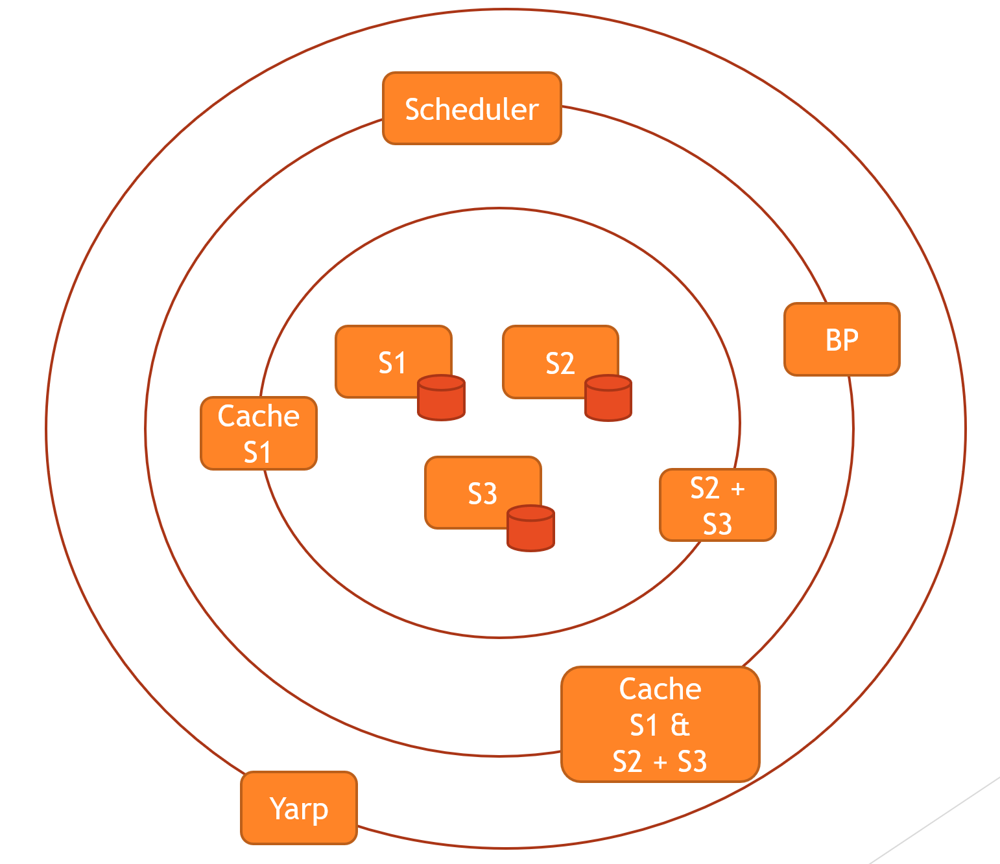
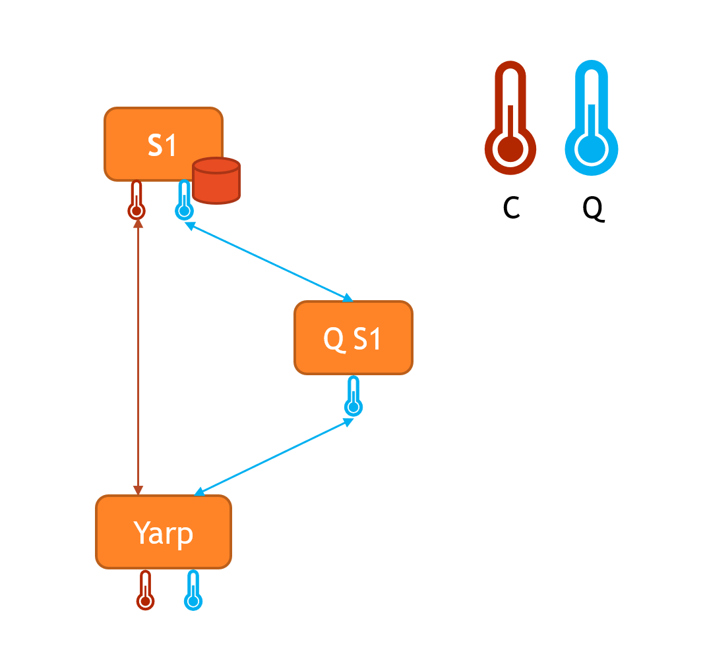
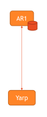
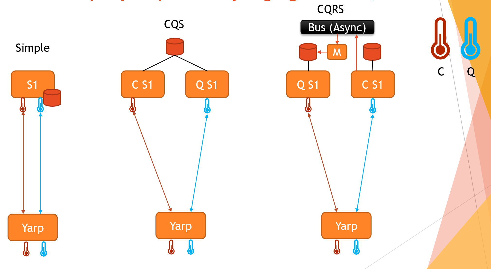
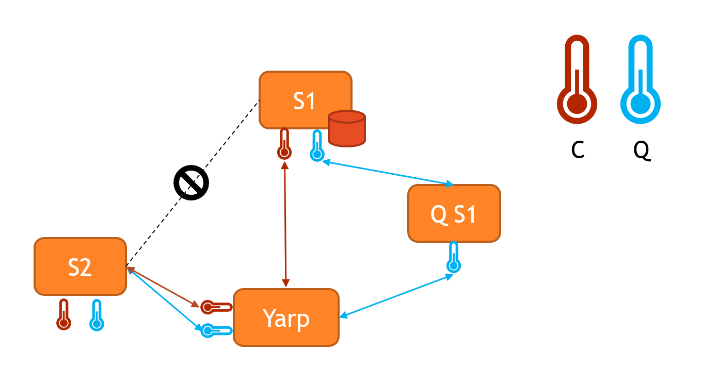

# Yarp
#### November 2020
During my micro-services architecture journey it was clear that it was important to have a reverse proxy.
This will help me to compose and unify from a gateway the requests to my services but also this will help me to implement a CQRS pattern
in an lean way.

Remark:
On a micro-services architecture you have 2 main communication patterns:
- Synchronous : Rest Api or gRpc
- Asynchronous: via message broker (Bus).

As here I am spoken about Yarp, I only focuse on the synchronous communication part of the microservices.

#### What is a micro-service.

Source from: https://microservices.io/

"Microservices - also known as the microservice architecture - is an architectural style that structures an application as a collection of services that are

- Highly maintainable and testable
- Loosely coupled
- Independently deployable
- Organized around business capabilities
- Owned by a small team

The microservice architecture enables the rapid, frequent and reliable delivery of large, complex applications. 
It also enables an organization to evolve its technology stack."

For me a micro-service is a generic service able to ingest and restitute data. It can transform data, enrich data
do orchestration based on the data, etc...

To decrease the complexity of an application and increase the functionalities, we add them into different microservices 
in an ognion layers. 
At the center of the ognion we will have the services manipulating the objects of the domain model (in DDD model)
of your application and the other layers will add composition, cache, business process, orchestration services, etc...

At the top level layer, we will find the Reverse proxy one which will root all the gRpc or Http 
requests to the good services.
 
##### Business context microservice
This kind of service will implement the basic functionalities and business rules arround the domain model objects probably in 
a CRUD way allowing to manipulate its entities. The service will be concentrated to serve the data in a secure and
quick way giving performance to access the data. There is always a storage associate to this kind of services. The Apis defined 
in the service will be based on the aggregate root used to manipulate the domain model objects.

The service will be able to be accessed from API but will be also connected to a BUS to send events and commands.
In both cases we don't put the full paylod on the messages (but for very tiny and stable entities like a measure)
to be sure that:
- we don't have to change immediately all the consumers listening on the BUS if the message change (by changing the aggregate root).
- we don't increase the bandwith with unused payload (often the Command or Event name provides enough information to the consumer).
- we avoid data duplication (referential data are simply queried when needed via the API).

##### Composition services
The purpose of this service is to provide a new object with enrich data by combining differents business objects (Company & Contracts by example).

##### Cache services.
This kind of service will add a cache layer to speed the result of request and dwindle the pressure on the storage system.
In real application, the business need is always to have the capability to query and return the set of data based on criteria.
In any case the GetByID and List of are important needs and must be addressed in a efficient way.
What is important to thing its the cost of a caching solution.

If the amount of data requested on your business context service is low enough that the pressure and speed are
sufficiently acceptable for your business needs, there is no reason to add this extra cache layer.

By redirecting the traffic from all queries endpoint or on some specific ones allows us to transparently add this
feature without any change to implement from the client tool.

 


##### CQRS via your reverse proxy (yarp).
The beautifull aspect when you can intoduce a reverse proxy in your architecture is the capability to start your application
by being concentrated to the need of the business => You don't have to immediately think about CQRS and if you have to
add your caching layer immediately.

You simply implement your business.



From your configuration file you inform the backend you want to reach like this:
In this example, the aggregate root service ar1 is implementing an Ar1Controller.

````json
{
  "ReverseProxy": {
    "Routes": [
      {
        "RouteId": "s1/ar1",
        "ClusterId": "s1",
        "AuthorizationPolicy": "Default",
        "Match": {
          "Path": "/api/ar1/{*remainder}"
        },
        "Transforms": [
          { "PathPattern": "/api/ar1/{*remainder}" }
        ]
    ],
    "Clusters": {
      "s1": {
        "Destinations": {
          "bc1/destination1": {
            "Address": "http://s1/"
          }
        }
      }
    }
  }
}
````
We simply here define that all requests for the api/ar1 will be redirected to the http://s1/api/ar1 service.

And that for all the HTTP methods: [GET, POST, PATCH, DELETE, PUT, etc...]

Now imagine that we need to add a dedicated query and command concept and split the command route from the query one.
We have just to redirect the HttpGet method to the dedicated query service.
We can also add a full separation with dedicated read database and model and enrich the query capabilities and keeping
the original features.


The reverse proxy file becomes.

````json
{
  "ReverseProxy": {
    "Routes": [
      {
        "RouteId": "s1/ar1/queries",
        "ClusterId": "s1cache",
        "AuthorizationPolicy": "Default",
        "Match": {
          "Methods": [ "GET" ],
          "Path": "/api/ar1/{*remainder}"
        },
        "Transforms": [
          { "PathPattern": "/api/ar1/{*remainder}" }
        ]
      },
      {
        "RouteId": "s1/ar1",
        "ClusterId": "s1",
        "AuthorizationPolicy": "Default",
        "Match": {
          "Path": "/api/ar1/{*remainder}"
        },
        "Transforms": [
          { "PathPattern": "/api/ar1/{*remainder}" }
        ]
    ],
    "Clusters": {
      "bc1": {
        "Destinations": {
          "bc1/destination1": {
            "Address": "http://s1/"
          }
        }
      },
     "bc1cache": {
        "Destinations": {
          "bc1cache/destination1": {
            "Address": "http://s1query/"
          }
        }
      }
    }
  }
}
````

The route order is very important, by introducting the filter on the Get methods, we can redirect the 
traffic to the query service.

#### API Gateway with Yarp.

In our microservices we implement by default Swagger with NSwag and publish the interfaces.
Each service offer 2 kinds of interfaces:
- Dedicated interfaces for the UIs (called facade).
- Dedicated interfaces for the other services (called interface).

The facade apis are protected and only visible by a user if he has the rights. So a normal user cannot used 
those interfaces but via the official UIs : Uwp, Wpf, Xamarin.Forms, Blazor.Net, etc...
On the other end, the interface are there to be consumed by everyone. At the level of the interface we implement
a versionning so an update of the service doesn't imply immediately a change from all the consumers.

The NSwag package is configured like this is a normal service.

````csharp
   public class Startup
    {
        // This method gets called by the runtime. Use this method to add services to the container.
        public void ConfigureServices(IServiceCollection services)
        {
            ...

            services.AddSwaggerDocument(option =>
            {
                option.DocumentName = "facade";
                option.ApiGroupNames = new[] { "facade" };
                option.PostProcess = postProcess =>
                {
                    postProcess.Info.Title = "Facade contracts are only used by Guis and no perinity is provided.";
                };
            });

            services.AddSwaggerDocument(option =>
            {
                option.DocumentName = "interface";
                option.ApiGroupNames = new[] { "interface" };
                option.PostProcess = postProcess =>
                {
                    postProcess.Info.Title = "Interface description.";
                };
            });

        }

        // This method gets called by the runtime. Use this method to configure the HTTP request pipeline.
        public void Configure(IApplicationBuilder app, IWebHostEnvironment env)
        {
            ...

            app.UseAuthentication();
            app.UseAuthorization();

            app.UseOpenApi(configure =>
             {
                 configure.DocumentName = "facade";
             })
            .UseOpenApi(configure =>
            {
                configure.DocumentName = "interface";
            })
            .UseSwaggerUi3(configure =>
            {
                configure.Path = "/swagger/facade";
                configure.DocumentPath = configure.Path + "/swagger.json";  
                configure.TagsSorter = "alpha";
                configure.OperationsSorter = "alpha";                
            })
            .UseSwaggerUi3(configure =>
            {
                configure.Path = "/swagger/interface";
                configure.DocumentPath = configure.Path + "/swagger.json";
                configure.TagsSorter = "alpha";
                configure.OperationsSorter = "alpha";
            });

        }
    }
````

We can see here that we have 2 swaggers completely distincts: one for the facade and one for the interface.
The swagger path will be http://s1/swagger/facade/swagger.json or http://s1/swagger/interface/swagger.json.

Now we introduce a Yarp service which is in fact a service like the other but with the following change:
- install the nuget package: Microsoft.ReverseProxy.
- Add a reverse proxy file.
- Configure the middleware to add the reverse proxy (read the reverse proxy file and route the traffic via the endpoint).
- Configure NSwag to add the routing of the different swagger endpoint.

````csharp
    public class Startup
    {
        // This method gets called by the runtime. Use this method to add services to the container.
        public void ConfigureServices(IServiceCollection services)
        {
            ...

            services.AddSwaggerDocument(option =>
            {
                option.DocumentName = "facade";
                option.ApiGroupNames = new[] { "facade" };
                option.PostProcess = postProcess =>
                {
                    postProcess.Info.Title = "Facade contracts are only used by Guis and no perinity is provided.";
                };
            });
            services.AddSwaggerDocument(option =>
            {
                option.DocumentName = "interface";
                option.ApiGroupNames = new[] { "interface" };
                option.PostProcess = postProcess =>
                {
                    postProcess.Info.Title = "Interface description.";
                };
            });

            services.AddReverseProxy().LoadFromConfig(Configuration.GetSection("ReverseProxy"));

        }

        // This method gets called by the runtime. Use this method to configure the HTTP request pipeline.
        public void Configure(IApplicationBuilder app, IWebHostEnvironment env)
        {
            ...

            app.UseOpenIdBearerInjector(new OpenIdBearerInjectorOptions { OpenIdSettings = OpenIdSettings });

            app.UseOpenApi(configure =>
            {
                configure.DocumentName = "facade";
            })
            .UseOpenApi(configure =>
            {
                configure.DocumentName = "interface";
            })
            .UseSwaggerUi3(configure =>
            {
                configure.Path = "/swagger/facade";
                configure.DocumentPath = configure.Path + "/swagger.json";
                configure.TagsSorter = "alpha";
                configure.OperationsSorter = "alpha";
                configure.SwaggerRoutes.Add(new NSwag.AspNetCore.SwaggerUi3Route("Environment", "/swagger/facade/swagger.json"));
                configure.SwaggerRoutes.Add(new NSwag.AspNetCore.SwaggerUi3Route("s1", "/swagger/s1/facade/swagger.json"));
                configure.SwaggerRoutes.Add(new NSwag.AspNetCore.SwaggerUi3Route("s2", "/swagger/s2/facade/swagger.json"));
            })
            .UseSwaggerUi3(configure =>
            {
                configure.Path = "/swagger/interface";
                configure.DocumentPath = configure.Path + "/swagger.json";
                configure.TagsSorter = "alpha";
                configure.OperationsSorter = "alpha";
                configure.SwaggerRoutes.Add(new NSwag.AspNetCore.SwaggerUi3Route("s1", "/swagger/s1/interface/swagger.json"));
                configure.SwaggerRoutes.Add(new NSwag.AspNetCore.SwaggerUi3Route("s2", "/swagger/s2/interface/swagger.json"));

            });

            app.UseEndpoints(endpoints =>
            {
                endpoints.MapControllers();
                endpoints.MapReverseProxy();
            });
        }
    }
````

Each time you need to add a service where there is a discovery need (Swagger vue), add a route to NSwag definition.

Here I have introduced the routing for 2 services s1 and s2.
At the level of the reversproxy.json file we have the 2 routes defined for /swagger/s1 and swagger/s2 that 
we introduced in the NSwag route topology of the Yarp project.

````json
{
  "ReverseProxy": {
    "Routes": [
      {
        "RouteId": "s1/swagger",
        "ClusterId": "s1",
        "AuthorizationPolicy": "Default",
        "Match": {
          "Path": "/swagger/s1/{*remainder}"
        },
        "Transforms": [
          { "PathPattern": "/swagger/{*remainder}" }
        ]
      },
      {
        "RouteId": "s2/swagger",
        "ClusterId": "s2",
        "AuthorizationPolicy": "Default",
        "Match": {
          "Path": "/swagger/s2/{*remainder}"
        },
        "Transforms": [
          { "PathPattern": "/swagger/{*remainder}" }
        ]
      }
    ],
    "Clusters": {
      "s1": {
        "Destinations": {
          "s1/destination1": {
            "Address": "http://s1/"
          }
        }
      },
      "s2": {
        "Destinations": {
          "s2/destination1": {
            "Address": "http://s2/"
          }
        }
      }
    }
  }
}
````

#### Routing strategy?



When inside your application you have to call another service pay attention that you go through the Yarp so 
when you change the query strategy by introducting a cache layer for example you don't have to manage this 
at the level of the BC2 service (this becomes completely transparent).

Only if you introduce a cache service (for example) between the bc1 calls, you have to call bc1 directly 
otherwhise you will never reach the service.


#### And about the security?

The yarp service is in fact a standard AspNetCore service where apis are requesting an OAuth2 token.

We have 2 usages of the service.
1. By calling it from an application and injecting an OAuth2 bearer token
2. By surfing the Swagger page.

It is possible to add in Swagger a login button to authenticate the user and then call the services.
I have taken another approach by mixing the service as a "normal" service and also a web site (the swagger pages).
By doing this I force a user to be authenticated (OpenId Connect) via an Authorization code flow before he/she 
can see the swagger pages. By doing this only an authorized user can see, surf and use the api.

A third method to use the api is via the basic authentication (user name password). This capability is there
to allow a consumer services having not the knowledge of doing an OAuth2 authenication to use the service and 
also to ease the usage of Postman. It is indeed very easy to call the service via a basic authentication with
Postman than with a bearer token. And honestly this is highly appreciate by the testers and project leaders.
The service will in fact play the role of the client by calling the authority (AzureAD or ADFS), create a bearer
token, cache it and injecting it on the authorization header request.

The AspNetCore Yarp project will simply take the authorization header (from the client or injected it via the basic authentication middleware)
and the targeted service will received an authenticated request and proceed if the user is authorized.

This is fine and very standard.

But what happens with the OpenId connect scenario?

When the client surf on the swagger pages, he/she is authenticated via an OpenId Connect (implemented via 
an authorization code flow) and the MSAL or ADAL library will cache for us the token. But this token is not 
injected into the authorization header and when the user will call an api, this will fail because the called 
service will not see a bearer token in the header...

This is why the Yarp project contains a middleware code that will retrieve the bearer token only for an 
OpenId Connect authentication method and will inject it in the authorization request header.
Yarp will then transport this information for us to the targeted service. And voilà we have a full secure api
gateway alowing us to manage our micro-services application like we want based on the needs in a lean way.


